# VERTICE CYBER - DIAGRAMAS MERMAID DOS AGENTES

> **Versão:** 1.0.0  
> **Data:** 17 Janeiro 2026  
> **Uso:** Copy/paste no Mermaid Live Editor ou geradores de imagem

---

## 🏛️ AGENT 01: ETHICAL MAGISTRATE

### Diagrama 1.1 - Fluxo de Validação Ética (7 Fases)

```mermaid
flowchart TD
    Start([Ação Solicitada]) --> Emit[Emite Evento:<br/>VALIDATION_REQUESTED]
    Emit --> Phase1{Fase 1:<br/>Governance Check}
    
    Phase1 -->|Dangerous Keywords| HumanReview[🚨 HUMAN REVIEW<br/>REQUIRED]
    Phase1 -->|Clean| Phase2{Fase 2:<br/>Always Require<br/>Approval?}
    
    Phase2 -->|Yes| HumanReview
    Phase2 -->|No| Phase3{Fase 3:<br/>Privacy Check}
    
    Phase3 -->|Has PII| Conditional[✅ APPROVED WITH<br/>CONDITIONS<br/>- Mask PII in logs<br/>- Privacy safeguards]
    Phase3 -->|No PII| Phase4{Fase 4:<br/>Fairness Check}
    
    Phase4 -->|Bias Detected| Rejected1[❌ REJECTED<br/>BY_ETHICS]
    Phase4 -->|Fair| Phase5{Fase 5:<br/>Transparency<br/>Check}
    
    Phase5 -->|Not Transparent| Rejected2[❌ REJECTED<br/>BY_GOVERNANCE]
    Phase5 -->|Transparent| Phase6{Fase 6:<br/>Accountability<br/>Check}
    
    Phase6 -->|No Audit Trail| Rejected3[❌ REJECTED<br/>BY_GOVERNANCE]
    Phase6 -->|Has Audit| Phase7{Fase 7:<br/>Security Check}
    
    Phase7 -->|Insecure| Rejected4[❌ REJECTED<br/>BY_SECURITY]
    Phase7 -->|Secure| Approved[✅ APPROVED]
    
    HumanReview --> Wait[⏳ Aguarda Aprovação<br/>Timeout: 5-60s]
    Wait -->|Approved| Approved
    Wait -->|Rejected| Rejected1
    Wait -->|Timeout| Rejected2
    
    Approved --> Store[💾 Store Decision<br/>in Memory]
    Conditional --> Store
    Rejected1 --> Store
    Rejected2 --> Store
    Rejected3 --> Store
    Rejected4 --> Store
    
    Store --> EmitComplete[Emite Evento:<br/>VALIDATION_COMPLETED]
    EmitComplete --> End([Return Decision])
    
    style HumanReview fill:#ff6b6b
    style Approved fill:#51cf66
    style Conditional fill:#4dabf7
    style Rejected1 fill:#ff6b6b
    style Rejected2 fill:#ff6b6b
    style Rejected3 fill:#ff6b6b
    style Rejected4 fill:#ff6b6b
```



### Diagrama 1.2 - Arquitetura do Magistrate


### Diagrama 1.3 - Sequência de Validação com Identity


---

## 🔍 AGENT 02: OSINT HUNTER

### Diagrama 2.1 - Pipeline de Investigação OSINT


### Diagrama 2.2 - Continuous Monitoring Loop


### Diagrama 2.3 - Correlation Engine (Attack Path)


---

## 🔮 AGENT 03: THREAT PROPHET

### Diagrama 3.1 - Predictive Threat Analysis


### Diagrama 3.2 - LSTM Threat Sequence Prediction

```mermaid
graph LR
    subgraph "Training Data: APT Campaigns"
        C1[APT29 Campaign:<br/>T1078 → T1003 → T1021 → T1071]
        C2[APT28 Campaign:<br/>T1566 → T1204 → T1059 → T1048]
        C3[Lazarus Campaign:<br/>T1190 → T1505 → T1053 → T1567]
    end
    
    C1 --> LSTM[LSTM Model<br/>128 units, 2 layers]
    C2 --> LSTM
    C3 --> LSTM
    
    LSTM --> Train[Training:<br/>50 epochs<br/>Validation Split: 20%]
    
    Train --> Model[(Trained Model<br/>Accuracy: 87%)]
    
    subgraph "Real-time Prediction"
        Current[Current Sequence:<br/>T1078 → T1003]
        Current --> Model
        Model --> Predict[Predicted Next:<br/>T1021 (80% prob)<br/>T1059 (65% prob)]
        
        Predict --> Proactive[Proactive Defense:<br/>- Enable T1021 detection<br/>- Monitor lateral movement<br/>- Alert SOC team]
    end
    
    style LSTM fill:#4dabf7
    style Model fill:#51cf66
    style Proactive fill:#ffd43b
```

### Diagrama 3.3 - ATT&CK Navigator Integration


---

## 🛡️ AGENT 05-07: IMMUNE SYSTEM TRIO

### Diagrama 5.1 - Biological Immune System Architecture


### Diagrama 5.2 - Agent Compromise Detection (< 100ms)


### Diagrama 5.3 - Self-Healing Process


---

## ⚔️ AGENT 08: WARGAME EXECUTOR (Purple Team)

### Diagrama 8.1 - Continuous Purple Teaming Cycle

```mermaid
flowchart TD
    Start([24/7 Loop Start]) --> Select[Select Adversary<br/>to Emulate]
    
    subgraph "Adversary Selection"
        Select --> DB[(Adversary DB:<br/>APT29, APT28,<br/>Lazarus, etc)]
        DB --> Profile[Load TTP Profile]
    end
    
    Profile --> RedTeam[Red Team Phase]
    
    subgraph "Red Team - Attack Execution"
        RedTeam --> Atomic[Atomic Red Team<br/>Test Selection]
        
        Atomic --> T1[Execute: T1078<br/>Valid Accounts]
        Atomic --> T2[Execute: T1003<br/>Credential Dumping]
        Atomic --> T3[Execute: T1021<br/>Remote Services]
        
        T1 --> Results1[Capture Results:<br/>- Success/Fail<br/>- Artifacts<br/>- IOCs]
        T2 --> Results2[Capture Results]
        T3 --> Results3[Capture Results]
    end
    
    Results1 --> BlueTeam[Blue Team Phase]
    Results2 --> BlueTeam
    Results3 --> BlueTeam
    
    subgraph "Blue Team - Validation"
        BlueTeam --> Check1{Was T1078<br/>Detected?}
        BlueTeam --> Check2{Was T1003<br/>Detected?}
        BlueTeam --> Check3{Was T1021<br/>Detected?}
        
        Check1 -->|Yes| Detected1[✅ Detection OK]
        Check1 -->|No| Gap1[❌ Detection Gap]
        
        Check2 -->|Yes| Detected2[✅ Detection OK]
        Check2 -->|No| Gap2[❌ Detection Gap]
        
        Check3 -->|Yes| Detected3[✅ Detection OK]
        Check3 -->|No| Gap3[❌ Detection Gap]
        
        Check1 --> Prevent1{Was T1078<br/>Prevented?}
        Check2 --> Prevent2{Was T1003<br/>Prevented?}
        Check3 --> Prevent3{Was T1021<br/>Prevented?}
        
        Prevent1 -->|Yes| Prevented1[✅ Prevention OK]
        Prevent1 -->|No| GapP1[❌ Prevention Gap]
        
        Prevent2 -->|Yes| Prevented2[✅ Prevention OK]
        Prevent2 -->|No| GapP2[❌ Prevention Gap]
        
        Prevent3 -->|Yes| Prevented3[✅ Prevention OK]
        Prevent3 -->|No| GapP3[❌ Prevention Gap]
    end
    
    Gap1 --> Gaps[Consolidate Gaps]
    Gap2 --> Gaps
    Gap3 --> Gaps
    GapP1 --> Gaps
    GapP2 --> Gaps
    GapP3 --> Gaps
    
    Gaps --> AutoFix{Can Auto-Fix?}
    
    AutoFix -->|Yes| Deploy[Deploy Fix:<br/>- New Sigma rule<br/>- Update firewall<br/>- Patch system]
    AutoFix -->|No| Ticket[Create Ticket<br/>for SOC Team]
    
    Deploy --> Metrics[Generate Metrics]
    Ticket --> Metrics
    
    subgraph "Threat Resilience Metrics"
        Metrics --> Coverage[Detection Coverage:<br/>78/100 techniques]
        Metrics --> MTTD[Mean Time to Detect:<br/>3.2 minutes]
        Metrics --> MTTR[Mean Time to Respond:<br/>12.5 minutes]
        Metrics --> FP[False Positive Rate:<br/>2.1%]
    end
    
    Coverage --> Report[Purple Team Report]
    MTTD --> Report
    MTTR --> Report
    FP --> Report
    
    Report --> Wait[Wait 1 hour]
    Wait --> Start
    
    style Gap1 fill:#ff6b6b
    style Gap2 fill:#ff6b6b
    style Gap3 fill:#ff6b6b
    style Detected1 fill:#51cf66
    style Detected2 fill:#51cf66
    style Detected3 fill:#51cf66
```



### Diagrama 8.2 - CALDERA Integration (MITRE)


---

## 🔧 AGENT 09: PATCH VALIDATOR ML

### Diagrama 9.1 - Smart Vulnerability Prioritization


### Diagrama 9.2 - ML Patch Compatibility Predictor


### Diagrama 9.3 - Patch Validation Pipeline

```mermaid
sequenceDiagram
    participant Scanner as Vuln Scanner
    participant PV as Patch Validator ML
    participant NVD as NVD/EPSS/KEV
    participant ML as ML Model
    participant Sandbox as Sandbox Env
    participant Prod as Production
    
    Scanner->>PV: Found CVE-2026-12345
    
    PV->>NVD: Enrich CVE
    NVD-->>PV: CVSS: 9.8, EPSS: 0.85, KEV: True
    
    PV->>PV: Calculate Priority: 92 (P0)
    
    PV->>PV: Find available patch
    
    PV->>ML: Predict compatibility
    ML-->>PV: Success Prob: 0.97
    
    alt High Confidence (> 0.95)
        PV->>Sandbox: Deploy patch
        Sandbox->>Sandbox: Run tests (30min)
        Sandbox-->>PV: All tests passed ✅
        
        PV->>Prod: Schedule deployment
        Prod->>Prod: Apply patch
        Prod-->>PV: Patch applied successfully
        
        PV->>PV: Verify CVE is patched
        PV->>PV: Update ML model (feedback)
    else Low Confidence
        PV->>PV: Create manual review ticket
    end
```



---

## 🔐 AGENT 12: CYBERSEC BASIC (Pentest Automation)

### Diagrama 12.1 - Full Automated Pentest Pipeline


### Diagrama 12.2 - Nuclei Template Automation

```mermaid
graph TB
    subgraph "Template Categories"
        All[All Templates:<br/>9000+]
        
        All --> Critical[Critical:<br/>cves/2024/, cves/2025/,<br/>exposures/configs/]
        All --> High[High:<br/>exposed-panels/,<br/>misconfigurations/]
        All --> Medium[Medium:<br/>default-logins/,<br/>exposed-tokens/]
        All --> Low[Low:<br/>technologies/,<br/>dns/]
    end
    
    Target[Target: example.com] --> Filter{Severity<br/>Filter}
    
    Filter -->|Critical Only| Critical
    Filter -->|High+| CriticalHigh[Critical + High]
    Filter -->|All| All
    
    Critical --> Nuclei[Nuclei Engine]
    CriticalHigh --> Nuclei
    All --> Nuclei
    
    Nuclei --> Execute[Execute Scan]
    
    Execute --> Results[Results:<br/>JSON Output]
    
    Results --> Parse[Parse Findings]
    
    subgraph "Categorization"
        Parse --> Cat1[Category: RCE<br/>Severity: Critical<br/>Count: 2]
        Parse --> Cat2[Category: SQLi<br/>Severity: High<br/>Count: 5]
        Parse --> Cat3[Category: XSS<br/>Severity: Medium<br/>Count: 12]
    end
    
    Cat1 --> Alert[🚨 Immediate Alert<br/>to SOC]
    Cat2 --> Ticket[Create Ticket<br/>P1 Priority]
    Cat3 --> Report[Add to Report]
    
    Alert --> Action[Automated<br/>Remediation?]
    
    Action -->|Yes| Fix[Auto-fix:<br/>- Patch<br/>- Block<br/>- Disable]
    Action -->|No| Manual[Manual<br/>Intervention]
    
    style Cat1 fill:#ff6b6b
    style Alert fill:#ff6b6b
    style Fix fill:#51cf66
```



---

## 🌐 ARCHITECTURE: COMPLETE SYSTEM VIEW

### Diagrama ARCH.1 - MCP Server Architecture


### Diagrama ARCH.2 - Event-Driven Communication

```mermaid
sequenceDiagram
    participant Client as Claude/Gemini
    participant MCP as MCP Server
    participant Tool1 as OSINT Hunter
    participant Bus as Event Bus
    participant Tool2 as Threat Prophet
    participant Tool3 as Immune System
    
    Client->>MCP: osint_investigate("hacker@evil.com")
    MCP->>Tool1: investigate()
    
    Tool1->>Bus: emit(OSINT_INVESTIGATION_STARTED)
    Note over Bus: Event published to subscribers
    
    Tool1->>Tool1: Check HIBP breaches
    Tool1->>Tool1: Shodan scan
    
    Tool1->>Bus: emit(OSINT_BREACH_DETECTED, {...})
    
    Bus->>Tool2: on(OSINT_BREACH_DETECTED)
    Bus->>Tool3: on(OSINT_BREACH_DETECTED)
    
    par Parallel Processing
        Tool2->>Tool2: Analyze breach data
        Tool2->>Tool2: Map to ATT&CK
        Tool2->>Bus: emit(THREAT_DETECTED)
    and
        Tool3->>Tool3: Calculate risk
        Tool3->>Tool3: Should auto-respond?
        Tool3->>Bus: emit(IMMUNE_RESPONSE_TRIGGERED)
    end
    
    Tool1->>Bus: emit(OSINT_INVESTIGATION_COMPLETED)
    Tool1->>MCP: return OSINTResult
    MCP->>Client: {...findings, breaches, risk_score...}
    
    Note over Bus,Tool3: Event-driven side effects continue
```

---

## 📈 METRICS & MONITORING

### Diagrama METRICS.1 - Real-time Metrics Dashboard

```mermaid
graph TB
    subgraph "Data Sources"
        S1[Ethical Magistrate:<br/>Decisions/hour]
        S2[OSINT Hunter:<br/>Breaches detected]
        S3[Threat Prophet:<br/>Predictions accuracy]
        S4[Immune System:<br/>Response time]
        S5[Purple Team:<br/>Coverage %]
        S6[Patch Validator:<br/>Auto-patch rate]
    end
    
    S1 --> Aggregator[Metrics<br/>Aggregator]
    S2 --> Aggregator
    S3 --> Aggregator
    S4 --> Aggregator
    S5 --> Aggregator
    S6 --> Aggregator
    
    Aggregator --> Dashboard[Real-time<br/>Dashboard]
    
    subgraph "Dashboard Panels"
        Dashboard --> P1[Detection Coverage:<br/>82% of ATT&CK]
        Dashboard --> P2[Mean Time to Detect:<br/>47ms]
        Dashboard --> P3[False Positive Rate:<br/>3.2%]
        Dashboard --> P4[Auto-Response Rate:<br/>76% autonomous]
        Dashboard --> P5[Agent Health:<br/>All 🟢 Healthy]
        Dashboard --> P6[Threat Level:<br/>🟡 Elevated]
    end
    
    P1 --> Alerts{Threshold<br/>Breach?}
    P2 --> Alerts
    P3 --> Alerts
    P4 --> Alerts
    
    Alerts -->|Yes| Notify[Slack/Email<br/>Notification]
    Alerts -->|No| Continue[Continue<br/>Monitoring]
    
    style P2 fill:#51cf66
    style P4 fill:#51cf66
    style P6 fill:#ffd43b
```

---

**FIM DOS DIAGRAMAS MERMAID**

Todos os diagramas acima podem ser:
1. Copiados direto para https://mermaid.live
2. Renderizados em Markdown (GitHub, Notion, etc.)
3. Exportados como PNG/SVG
4. Usados em documentação técnica

Cada diagrama ilustra aspectos diferentes dos agentes:
- **Flowcharts**: Processos e decisões
- **Sequence Diagrams**: Interações entre componentes
- **State Diagrams**: Máquinas de estado
- **Architecture Diagrams**: Visão geral do sistema